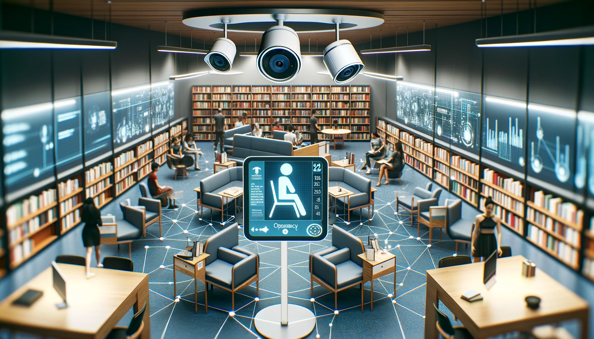
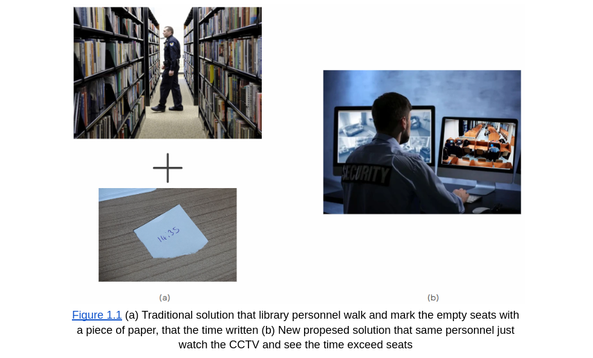
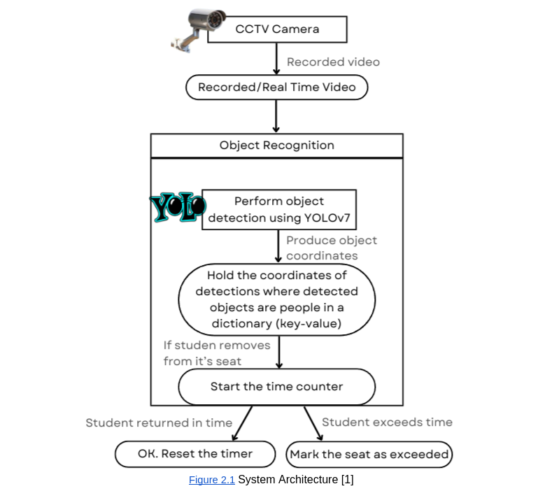
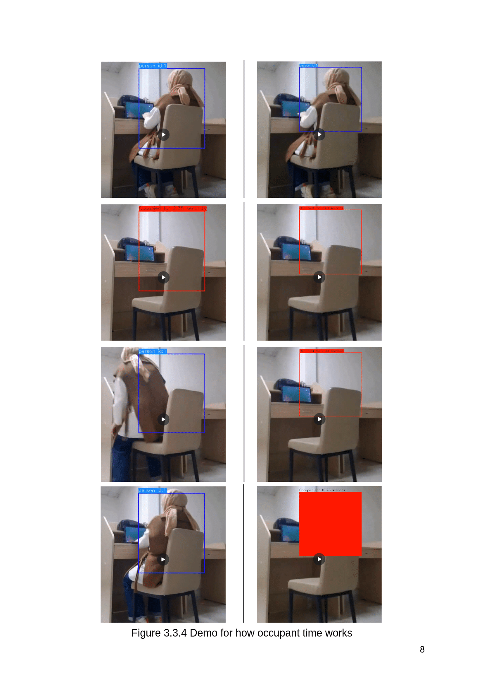

<div align="center">
<h1>
    🪑 SeatWatch: Advanced Library Seat Occupancy Detection
</h1>

<p>
<strong>Real-time library seat occupancy detection using YOLOv7 object detection and tracking</strong>
</p>

<div>
    
</div>

<div>
  <a target="_blank" href="https://colab.research.google.com/github/asumansaree/Library-Seat-Occupancy-Detection">
    
  </a>
  <a href="#installation">
    
  </a>
  <a href="#license">
    
  </a>
</div>
</div>

---

## 🎯 About The Project

SeatWatch is an AI-powered system that monitors library seat occupancy in real-time using computer vision. It detects when seats are occupied (with or without a person present) and tracks how long belongings have been left unattended, helping libraries manage space more efficiently.

### 🌟 Key Features

- **Real-time Detection**: Uses YOLOv7 for accurate person and chair detection
- **Object Tracking**: Advanced SORT algorithm tracks individual seats over time  
- **Occupancy Timing**: Monitors how long seats remain occupied without a person
- **Automated Alerts**: Flags seats held too long with "TIME EXCEEDED" warnings
- **Video Processing**: Supports various video formats (MP4, AVI, etc.)



### 🏗️ System Architecture



---

## 🚀 Quick Start

### Prerequisites

- **Python 3.8+** installed on your system
- **~3GB** free disk space (for dependencies and models)
- **Internet connection** for downloading models

### Installation

1. **Clone the repository**
   ```bash
   git clone https://github.com/priyanshuharshbodhi1/Library-Seat-Occupancy-Detection
   cd Library-Seat-Occupancy-Detection
   ```

2. **Set up virtual environment** (recommended)
   ```bash
   python3 -m venv venv
   source venv/bin/activate  # On Windows: venv\Scripts\activate
   ```

3. **Install dependencies**
   ```bash
   pip install -r requirements.txt
   ```

4. **Download model weights**
   ```bash
   python download_models.py
   ```
   This downloads the YOLOv7 weights (~74MB) required for detection.

5. **Verify installation**
   ```bash
   python -c "import cv2, torch, numpy; print('✅ Installation successful!')"
   ```

---

## 💻 Usage

### Option 1: REST API (Recommended for Production)

The project now includes a full-featured REST API for video processing via HTTP requests.

```bash
# Quick start with Python script
python run_api.py

# Or with Docker
docker-compose up -d
```

**Upload video and get results:**
```python
import requests

# Upload video
response = requests.post(
    "http://localhost:8000/api/detect",
    files={"video": open("library_video.mp4", "rb")}
)
job_id = response.json()["job_id"]

# Check status
status = requests.get(f"http://localhost:8000/api/jobs/{job_id}").json()

# Download results
requests.get(f"http://localhost:8000/api/download/{job_id}")
```

📖 **Full API Documentation**: See [API_README.md](API_README.md)

**API Features:**
- 🌐 RESTful HTTP endpoints
- 📤 Video upload via multipart/form-data
- 📊 JSON results with detection statistics
- 🎥 Download processed videos
- 📈 Real-time progress tracking
- 🐳 Docker support
- 📝 Interactive API docs at `/docs`

---

### Option 2: Command Line (Direct Processing)

#### Basic Usage
```bash
python detect_and_track.py --source your_video.mp4
```

#### Advanced Usage
```bash
python detect_and_track.py \
    --weights yolov7.pt \
    --source "library_video.mp4" \
    --conf-thres 0.4 \
    --classes 0 56 \
    --name "Library_Detection_Run" \
    --view-img
```

#### Command Line Arguments

| Argument | Description | Default | Example |
|----------|-------------|---------|---------|
| `--source` | Input video file path | **Required** | `"video.mp4"` |
| `--weights` | Model weights file | `yolov7.pt` | `yolov7.pt` |
| `--conf-thres` | Detection confidence threshold | `0.25` | `0.4` |
| `--classes` | Specific classes to detect | All classes | `0 56` |
| `--name` | Output experiment name | Auto-generated | `"my_test"` |
| `--view-img` | Show real-time video preview | `False` | Add flag |

#### Detected Classes
- **Class 0**: Person (human detection) 👤
- **Class 56**: Chair (furniture detection) 🪑  
- Use `--classes 0 56` to detect only people and chairs for better performance

---

## 📁 Project Structure

```
Library-Seat-Occupancy-Detection/
├── 📄 detect_and_track.py      # Main detection script
├── 📄 sort.py                  # SORT tracking algorithm
├── 📄 download_models.py       # Model download utility
├── 📄 requirements.txt         # Python dependencies
├── 📂 models/                  # YOLOv7 model architecture
├── 📂 utils/                   # Helper functions and utilities
├── 📂 data/                    # Configuration files
├── 📂 doc/                     # Documentation and images
├── 📂 runs/                    # Output videos (auto-created)
├── 🧠 yolov7.pt               # Model weights (downloaded)
└── 📄 README.md               # This file
```

---

## 📊 Sample Output

### Output Location
Results are automatically saved to:
```
runs/detect/{experiment_name}/your_video.mp4
```

### Visual Features
- 🔴 **Red boxes**: People with unique tracking IDs
- 🟡 **Yellow boxes**: Chairs and furniture  
- ⏰ **Timing info**: Duration of seat occupancy
- ⚠️ **Alerts**: "TIME EXCEEDED" for seats held too long



---

## 🛠️ Troubleshooting

<details>
<summary><strong>🐍 Python Environment Issues</strong></summary>

**ModuleNotFoundError: No module named 'cv2'**
```bash
# Ensure virtual environment is activated
source venv/bin/activate

# Reinstall OpenCV
pip install opencv-python
```

**Virtual environment not working**
```bash
# Recreate environment
rm -rf venv
python3 -m venv venv
source venv/bin/activate
pip install -r requirements.txt
```
</details>

<details>
<summary><strong>📦 Model and File Issues</strong></summary>

**Model weights not found**
```bash
# Run the download script
python download_models.py

# Or download manually
wget https://github.com/WongKinYiu/yolov7/releases/download/v0.1/yolov7.pt
```

**Video file issues**
```bash
# Check supported formats: MP4, AVI, MOV, MKV
# Ensure video file path is correct
ls -la your_video.mp4
```
</details>

<details>
<summary><strong>⚡ Performance Issues</strong></summary>

**Slow processing**
- Use smaller videos for testing (< 1GB)
- Increase `--conf-thres` to 0.4 or higher
- Close other applications
- Consider using GPU if available

**High memory usage**
- Process shorter video clips
- Reduce video resolution
- Monitor with `htop` or Task Manager
</details>

---

## 🔧 Development

### Running Tests
```bash
# Test with sample data
python detect_and_track.py --source data/sample_video.mp4 --view-img
```

### Contributing
1. Fork the repository
2. Create a feature branch (`git checkout -b feature/amazing-feature`)
3. Commit your changes (`git commit -m 'Add amazing feature'`)
4. Push to the branch (`git push origin feature/amazing-feature`)
5. Open a Pull Request

---

## 📖 Technical Details

For detailed technical documentation and research background, see:
- [📋 Technical Documentation](https://docs.google.com/document/d/1pJ2VXuCuY54If5JJqTePYmlqCHkCWHwM6suYYAaN2k4/edit?usp=sharing)
- [🔬 Research Papers](#references)

---

## 💾 System Requirements

| Component | Requirement |
|-----------|-------------|
| **OS** | Windows 10+, macOS 10.14+, Ubuntu 18.04+ |
| **Python** | 3.8 - 3.11 |
| **RAM** | 8GB minimum, 16GB recommended |
| **Storage** | 3GB free space |
| **GPU** | Optional (CUDA-compatible for faster processing) |

---

## 📞 Contact & Support

- **Author**: Asuman Sare ERGUT  
- **Email**: asumansaree@gmail.com
- **Issues**: [GitHub Issues](https://github.com/priyanshuharshbodhi1/Library-Seat-Occupancy-Detection/issues)

---

## 📜 References

- [YOLOv7 Object Tracking](https://github.com/RizwanMunawar/yolov7-object-tracking)
- Anish Aralikatti et al 2020 J. Phys.: Conf. Ser. 1706 012149  
- Redmon J, Divvala S, Girshick R and Farhadi A You Only Look Once: Unified, Real-Time Object Detection 2016 IEEE Conference on Computer Vision and Pattern Recognition
- [COCO 2017 Dataset](http://cocodataset.org)

---

## 📄 License

This project is licensed under the MIT License - see the [LICENSE](LICENSE) file for details.

---

<div align="center">
<p>Made with ❤️ for smarter library management</p>
</div>
